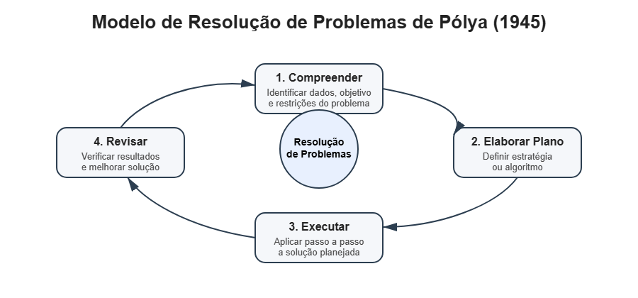
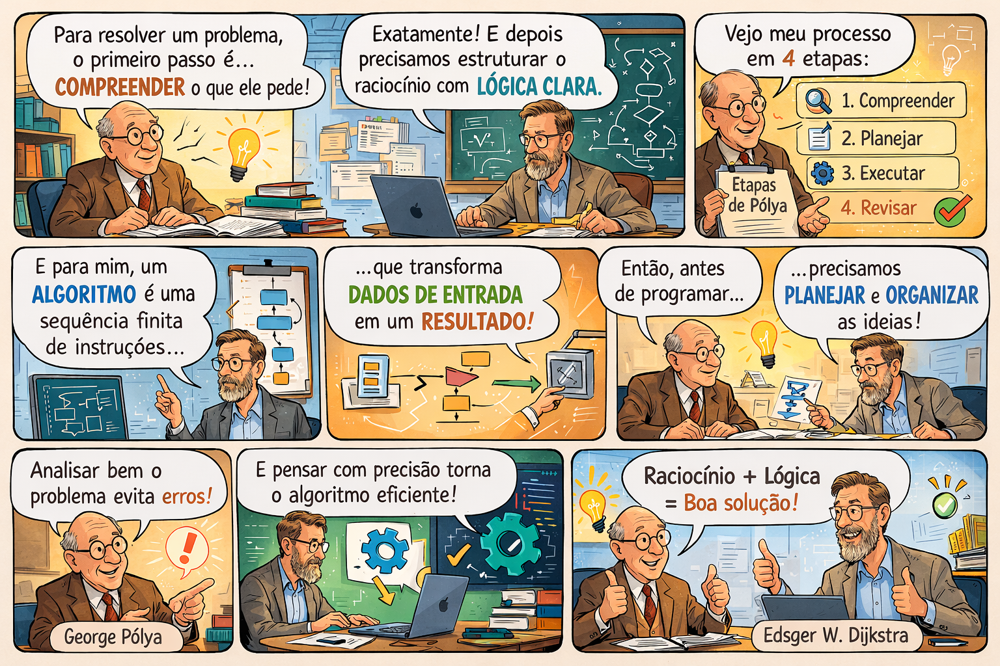
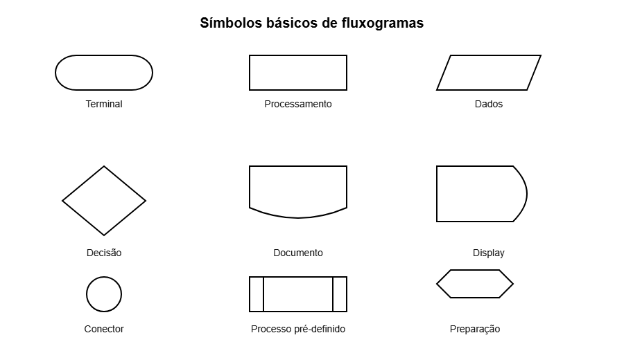
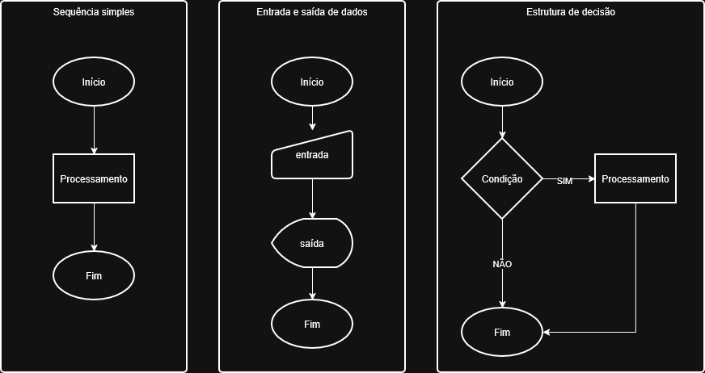
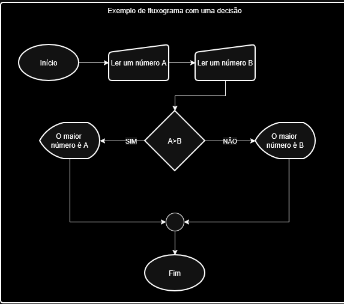

### Problemas e soluções

O ponto de partida para o estudo de algoritmos e programação é a compreensão de que a computação surge da necessidade de **resolver problemas de forma sistemática**. Em termos gerais, um problema pode ser entendido como uma situação em que existe um estado inicial, um objetivo a ser alcançado e um conjunto de restrições ou condições que precisam ser respeitadas. No contexto da computação, a resolução desses problemas ocorre por meio de procedimentos bem definidos, que posteriormente podem ser executados por um computador.

No processo de aprendizagem da programação, é importante compreender que o foco inicial não está apenas na linguagem utilizada, mas no desenvolvimento da **capacidade de estruturar soluções lógicas** para diferentes tipos de problemas. O livro *Introdução à Programação com Python* enfatiza exatamente esse aspecto: seu objetivo principal é ensinar a **programar e desenvolver raciocínio lógico**, independentemente da linguagem utilizada, utilizando Python apenas como meio didático para exercitar esse pensamento algorítmico .

A formulação de problemas computacionais pode ser observada em situações simples do cotidiano. Por exemplo, calcular a média de notas de um estudante, determinar se uma pessoa pode obter um empréstimo ou ordenar uma lista de números são todos exemplos de problemas que podem ser resolvidos por meio de procedimentos lógicos. Em programação, esses procedimentos são descritos como **sequências de passos bem definidos**, que podem ser interpretados e executados por um computador.

Nesse sentido, **George Pólya**, matemático conhecido por seus estudos sobre resolução de problemas, apresenta uma abordagem amplamente utilizada no ensino de lógica e algoritmos. Segundo Pólya (1945), o processo de resolução de um problema envolve quatro etapas fundamentais: compreender o problema, elaborar um plano de solução, executar o plano e revisar o resultado obtido. Essa abordagem é particularmente relevante no ensino de programação, pois incentiva o estudante a analisar cuidadosamente o problema antes de iniciar a implementação de uma solução.



Outro autor clássico nessa área é **Edsger W. Dijkstra**, um dos pioneiros da ciência da computação. Dijkstra enfatiza que o desenvolvimento de algoritmos exige **precisão lógica e clareza na descrição dos passos que levam à solução**. Para o autor, um algoritmo deve ser compreendido como uma sequência finita de instruções que transforma um conjunto de dados de entrada em um resultado desejado (DIJKSTRA, 1976). Essa visão reforça a importância de estruturar o raciocínio antes da implementação em uma linguagem de programação.


Fonte: construida com auxílio de IA (GPT)

Assim, a resolução de problemas em programação pode ser entendida como um processo composto por três elementos fundamentais:

* **o problema**, que representa a situação ou desafio a ser resolvido;
* **o algoritmo**, que descreve a sequência lógica de passos necessários para chegar à solução;
* **o programa**, que é a implementação desse algoritmo em uma linguagem que o computador possa executar.

Compreender essa relação é essencial para o aprendizado inicial da programação. Antes de escrever código, o estudante precisa aprender a **analisar o problema, decompor suas partes e organizar uma estratégia lógica de solução**. Somente após essa etapa é que a implementação em uma linguagem de programação passa a fazer sentido.

Dessa forma, o estudo de algoritmos pode ser visto como o desenvolvimento de uma forma estruturada de pensamento. Ao longo da disciplina, os estudantes aprenderão a transformar problemas do cotidiano em soluções computacionais, utilizando diferentes formas de representação, como **pseudocódigo, fluxogramas e programas executáveis**.

# Notação

Após compreender que um **algoritmo é uma sequência finita de passos organizados para resolver um problema**, surge uma questão importante no processo de aprendizagem de programação: **como representar esses passos de forma clara antes de escrever um programa em uma linguagem específica**.

No desenvolvimento de software, é comum que o programador primeiro **estruture a lógica da solução** e somente depois a implemente em uma linguagem como Python, Java ou C. Para isso, utilizam-se formas de representação conhecidas como **notações de algoritmo**. Entre as mais utilizadas no ensino de lógica de programação estão:

* **Fluxogramas**
* **Pseudocódigo**

Essas formas de representação permitem que a lógica do algoritmo seja compreendida independentemente da linguagem de programação utilizada.

# Fluxogramas

O **fluxograma** é uma representação gráfica de um algoritmo.
Nele, cada etapa da solução é representada por **símbolos geométricos conectados por setas**, que indicam o fluxo de execução do algoritmo.

O objetivo principal do fluxograma é **visualizar a sequência de operações e decisões que compõem a solução de um problema**.

Os fluxogramas utilizados na representação de algoritmos baseiam-se em convenções padronizadas internacionalmente. Entre as principais referências está a norma **ISO 5807:1985**, que define símbolos e convenções para a documentação gráfica de processos de informação, incluindo diagramas de fluxo de programas e de dados. Essa norma consolidou especificações anteriores, entre elas a norma **ANSI X3.5 (1970)**, estabelecendo diretrizes para a representação visual da sequência de operações e da estrutura lógica empregada no desenvolvimento de programas de computador. A Figura a seguir apresenta alguns dos símbolos mais utilizados na representação de fluxogramas.


Mesmo que existam pequenas variações entre ferramentas, os símbolos fundamentais permanecem os mesmos, as setas indicam **a ordem de execução das etapas do algoritmo**, conectando os símbolos do fluxograma, isto, é são responsáveis por indicar **a direção do fluxo do processo dentro do algoritmo**. 




O Processamento, representa qualquer **cálculo, operação ou ação executada pelo algoritmo**.

Exemplos de operações:

* somar dois números
* calcular uma média
* atualizar uma variável

A Entrada / Saída de dados, representa **dados fornecidos pelo usuário ou apresentados pelo programa**.

Exemplos:

* ler um número digitado pelo usuário
* exibir um resultado na tela

No guia de fluxogramas, esse símbolo é descrito como a representação de **dados que entram ou são exibidos ao usuário durante o processamento**. 

O símbolo de Decisão, representa um **ponto de decisão no algoritmo**, no qual uma condição é avaliada e o fluxo pode seguir por caminhos diferentes, em geral está associado a estruturas do tipo se...então. No fluxograma, isso aparece como um **losango com dois caminhos possíveis**.

### Exemplo de Fluxograma

Problema:
Ler dois números e mostrar qual é o maior, fluxograma simplificado:


Esse tipo de representação facilita compreender o funcionamento do algoritmo **antes de implementar o código**.

---
# Pseudocódigo

Outra forma muito utilizada para representar algoritmos é o **pseudocódigo**.

O pseudocódigo consiste em uma descrição textual estruturada da lógica de um algoritmo, escrita de maneira semelhante à linguagem natural, porém organizada de forma próxima à estrutura das linguagens de programação. Seu principal objetivo é permitir que a lógica da solução seja compreendida antes da implementação em uma linguagem específica, como Python, Java ou C.

Essa forma de representação utiliza comandos simples que descrevem operações fundamentais de um algoritmo, como:

* leitura de dados
* atribuição de valores
* tomada de decisões
* repetição de operações
* apresentação de resultados

No ensino de programação no Brasil, é comum utilizar uma forma de pseudocódigo chamada **Portugol**, na qual as instruções são escritas em português. Essa abordagem facilita o aprendizado inicial, pois permite que o estudante concentre sua atenção no **raciocínio lógico do algoritmo**, sem a complexidade sintática de linguagens de programação reais.

Uma das ferramentas educacionais utilizadas para esse fim é o **G-Portugol**, um ambiente de desenvolvimento voltado ao ensino de algoritmos. O sistema permite escrever, executar e testar algoritmos utilizando comandos estruturados em português, aproximando o estudante dos conceitos da programação estruturada, como entrada e saída de dados, estruturas condicionais e estruturas de repetição (G-PORTUGOL, 2010). 

---

#### Estrutura básica de um algoritmo em Portugol

De acordo com a organização apresentada no manual do **G-Portugol**, um algoritmo geralmente é composto por três partes principais:

1. **identificação do algoritmo**
2. **bloco de instruções**
3. **término do algoritmo**

A estrutura geral pode ser representada da seguinte forma:

```
Algoritmo nome_do_algoritmo

Inicio

   comandos do algoritmo

Fim
```

O bloco delimitado por **Inicio** e **Fim** contém as instruções que serão executadas pelo algoritmo.

---

#### Comandos básicos do Portugol

Os algoritmos escritos em Portugol utilizam comandos simples que representam operações comuns em programação.

#### Entrada de dados

O comando **leia** é utilizado para receber dados fornecidos pelo usuário durante a execução do algoritmo.

Exemplo:

```
leia numero
```

Nesse caso, o algoritmo solicita que o usuário digite um valor que será armazenado na variável **numero**.

---

#### Saída de dados

O comando **escreva** é utilizado para exibir informações ou resultados na tela.

Exemplo:

```
escreva resultado
```

Esse comando permite apresentar mensagens ou valores calculados pelo algoritmo.

---

#### Atribuição de valores

A atribuição é utilizada para armazenar ou atualizar valores em uma variável.

Exemplo:

```
soma <- A + B
```

Nesse caso, o resultado da soma entre **A** e **B** é armazenado na variável **soma**.

---

#### Estruturas condicionais

Estruturas condicionais permitem que o algoritmo tome decisões com base em uma condição lógica.

A estrutura mais comum é a instrução **se**.

Exemplo:

```
se A > B então
    escreva A
senão
    escreva B
fimse
```

Nesse caso, o algoritmo verifica qual número é maior e exibe o valor correspondente.

---

#### Exemplo completo de pseudocódigo

O exemplo a seguir apresenta um algoritmo simples que lê dois números e mostra qual deles é o maior.

```
Algoritmo maior_numero

Inicio

   leia A
   leia B

   se A > B então
       escreva A
   senão
       escreva B
   fimse

Fim
```

Nesse exemplo aparecem alguns comandos fundamentais do Portugol.

| Comando | Função                          |
| ------- | ------------------------------- |
| leia    | recebe dados do usuário         |
| escreva | apresenta informações na tela   |
| se      | avalia uma condição lógica      |
| senão   | define o caminho alternativo    |
| fimse   | encerra a estrutura condicional |

Essas estruturas representam os **elementos básicos da programação estruturada**, que serão utilizados ao longo da disciplina para desenvolver algoritmos cada vez mais complexos.

---

# Comparação entre Fluxograma e Pseudocódigo

| Característica | Fluxograma                                | Pseudocódigo                          |
| -------------- | ----------------------------------------- | ------------------------------------- |
| Forma          | Gráfica                                   | Textual                               |
| Objetivo       | Visualizar o fluxo do algoritmo           | Descrever a lógica passo a passo      |
| Uso didático   | Muito útil para iniciantes                | Mais próximo da programação real      |
| Complexidade   | Pode ficar grande em algoritmos complexos | Escala melhor para algoritmos maiores |

Na prática, **ambos podem ser utilizados para planejar a solução de um problema antes da implementação do programa**.

---

### Importância dessas notações no aprendizado

A utilização de fluxogramas e pseudocódigo possui um papel fundamental no ensino de programação porque permite que o estudante:

* compreenda a lógica da solução
* organize o raciocínio passo a passo
* identifique erros conceituais antes de programar
* desenvolva pensamento algorítmico

Somente depois dessa etapa a solução é transformada em um **programa em uma linguagem de programação**, como será estudado nas próximas unidades da disciplina.

---

### Referências

DIJKSTRA, Edsger W. *A Discipline of Programming*. Englewood Cliffs: Prentice-Hall, 1976.

G-PORTUGOL. **Manual do usuário do G-Portugol.** 2010. Disponível em https://gportugol.github.io/ 

MANZANO, José Augusto Navarro Garcia. **Revisão e discussão da norma ISO 5807 – 1985(E): proposta para padronização formal da representação gráfica da linha de raciocínio lógico utilizada no desenvolvimento da programação de computadores a ser definida no Brasil.** *THESIS*, São Paulo, v. 1, n. 1, p. 1–31, 1º semestre 2004.

PÓLYA, George. *How to Solve It: A New Aspect of Mathematical Method*. Princeton: Princeton University Press, 1945.

PEREIRA, Nilo Ney Coutinho Menezes. *Introdução à Programação com Python*. São Paulo: Novatec, 2014.
