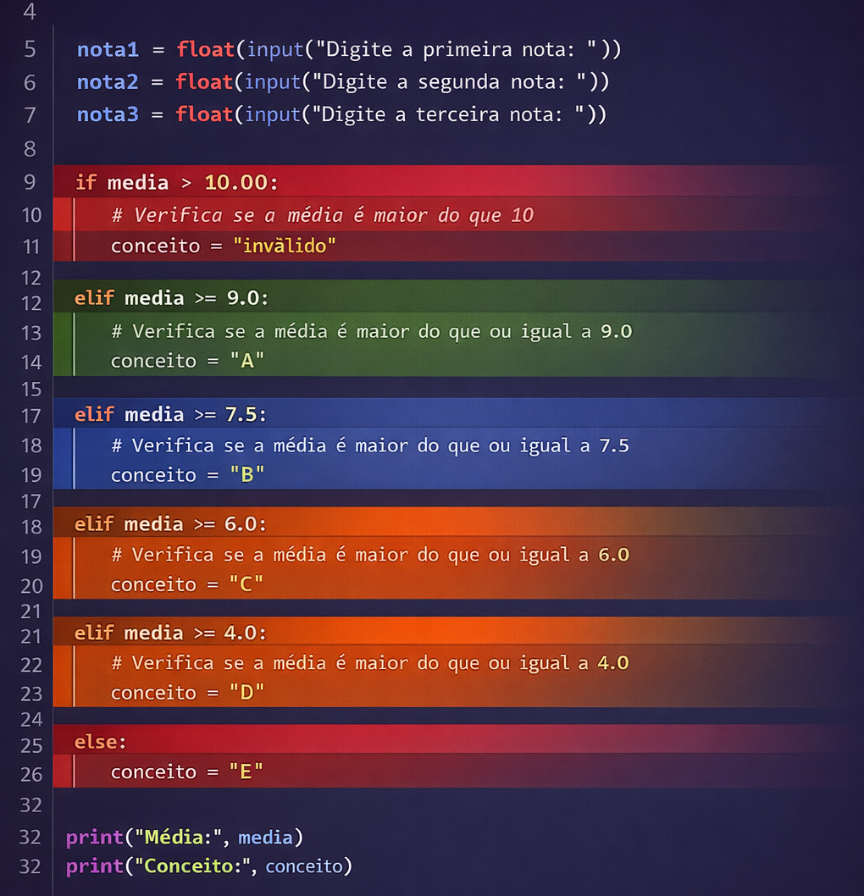
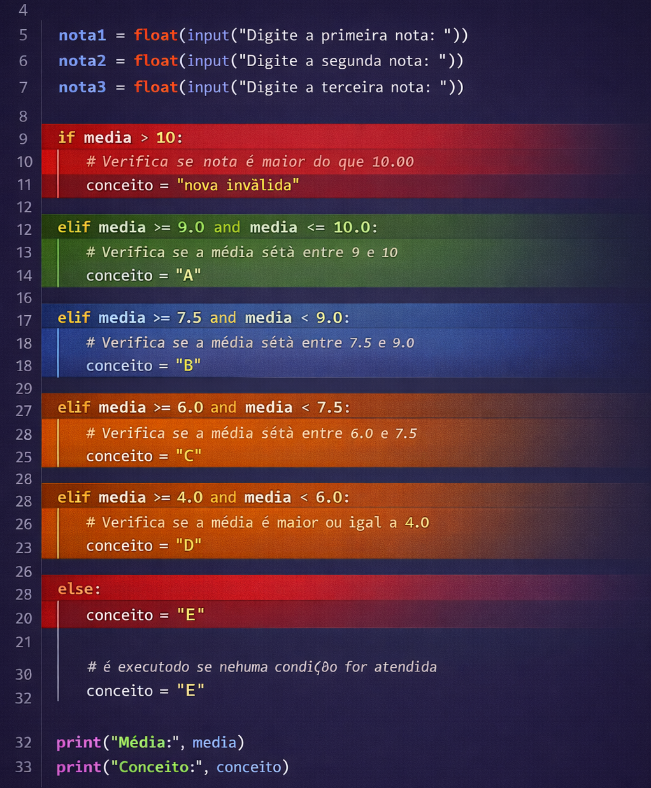
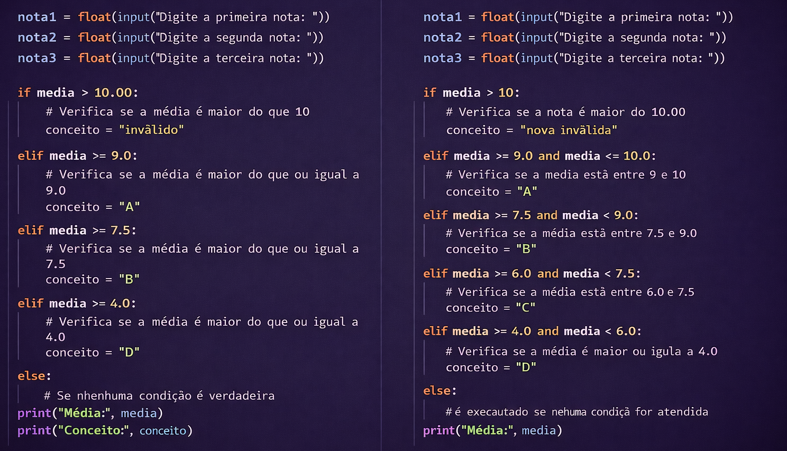

### Estruturas de decisão

As estruturas de controle são fundamentais na construção de algoritmos, pois permitem que um programa tome decisões e repita ações com base em determinadas condições. Elas definem o fluxo de execução, ou seja, a ordem em que as instruções do código são executadas.

Em Python, as estruturas de controle mais comuns são:

Condicionais (if, elif, else), que permitem executar blocos de código diferentes dependendo de uma condição ser verdadeira ou falsa;

Essas estruturas tornam os programas dinâmicos e adaptáveis, permitindo resolver problemas mais complexos. Com elas, deixamos de executar comandos em sequência rígida e passamos a controlar logicamente o comportamento do código — como, por exemplo, validar uma senha. Aprender a usá-las corretamente é um passo decisivo para a escrita de algoritmos eficientes e inteligentes.

### If, if ... else, if ... elif .. else

Em muitas situações, precisamos que nosso programa se comporte de maneiras diferentes dependendo de certas condições. Por exemplo: "Se a idade for maior que 18, permitir acesso; caso contrário, negar acesso". Para isso, usamos estruturas condicionais.

# Teste

> [!TIP]
> Este bloco deve funcionar com o plugin flexible-alerts.
>
> - item 1
> - item 2


:::tip

Python oferece as seguintes formas básicas de controle condicional:

if

if ... else

if ... elif ... else

:::

Essas estruturas permitem que partes do código sejam executadas somente quando certas expressões booleanas forem verdadeiras.

**A estrutura if**, é a forma mais simples de condição: Se a condição idade >= 18 for verdadeira, o bloco indentado abaixo de if será executado.

```python
idade = 20
if idade >= 18:
    print("Você é maior de idade.")
```

**A estrutura if ... else**, quando queremos oferecer dois caminhos, um para o caso da condição ser verdadeira, e outro para o caso ser falsa:

```python
idade = 16
if idade >= 18:
    print("Você é maior de idade.")
else:
    print("Você é menor de idade.")
```

**A estrutura if ... elif ... else**, é usada para verificar várias condições diferentes, usamos o elif (abreviação de "else if"): A primeira condição verdadeira encontrada será executada, e as demais serão ignoradas.

```python
nota = 7.5
if nota >= 9:
    print("Excelente!")
elif nota >= 7:
    print("Aprovado.")
elif nota >= 5:
    print("Recuperação.")
else:
    print("Reprovado.")
```

:::warning
Indentação é obrigatória

Python não usa chaves {} como em outras linguagens. O bloco de código que pertence ao if, else ou elif deve estar indentado com espaços (por convenção, 4 espaços):
:::

### Estrutura condicional combinando operadores relacionais e lógicos

Esses operadores comparam dois valores e retornam um valor **booleano** (`True` ou `False`).

| Operador | Significado | Exemplo | Resultado |
|----------|-------------|--------|-----------|
| `==` | 🔵 Igual a | `5 == 5` | ✅ `True` |
| `!=` | 🟠 Diferente de | `4 != 3` | ✅ `True` |
| `>` | 🟢 Maior que | `10 > 7` | ✅ `True` |
| `<` | 🟣 Menor que | `2 < 3` | ✅ `True` |
| `>=` | 🟡 Maior ou igual a | `7 >= 7` | ✅ `True` |
| `<=` | 🔴 Menor ou igual a | `5 <= 4` | ❌ `False` |

#### Exemplo com if
```python
idade = 20
if idade == 20:
    print("A idade é exatamente 20.")
if idade != 18:
    print("A idade não é 18.")
if idade > 18:
    print("Maior que 18.")
if idade < 25:
    print("Menor que 25.")
if idade >= 20:
    print("Maior ou igual a 20.")
if idade <= 21:
    print("Menor ou igual a 21.")
```
#### Usando os operadores lógicos para combinar **condições booleanas**.

| Operador | Nome | Exemplo | Resultado |
|----------|------|--------|-----------|
| `and` | 🔵 E lógico | `True and True` | ✅ `True` |
| `or` | 🟢 OU lógico | `True or False` | ✅ `True` |
| `not` | 🔴 Negação | `not True` | ❌ `False` |

```python
idade = 25
tem_carteira = True
# AND: ambas as condições devem ser verdadeiras
if idade >= 18 and tem_carteira:
    print("Pode dirigir.")
# OR: pelo menos uma condição deve ser verdadeira
if idade < 18 or not tem_carteira:
    print("Não pode dirigir.")
# NOT: inverte o valor lógico
if not False:
    print("Isso sempre será verdadeiro.")
# Combinando com operadores relacionais
nota = 7.5
if nota >= 7 and nota <= 10:
    print("Aprovado com boa nota.")
```

### Estrutura condicional encadeada

Em muitos algoritmos é necessário avaliar várias possibilidades para determinar qual ação deve ser executada. Para isso utilizamos uma **estrutura condicional encadeada**, formada pelas instruções `if`, `elif` e `else`. Nesse tipo de estrutura, o programa testa uma condição inicial e, caso ela não seja satisfeita, passa a testar a próxima condição da sequência. Esse processo continua até que uma condição seja verdadeira ou até que o bloco `else` seja executado. Cada condição possui um **bloco de código associado**, definido pela **identação** das linhas em Python. Assim, apenas o bloco correspondente à primeira condição verdadeira será executado. Esse tipo de organização é muito comum quando precisamos classificar valores em **faixas**, como no exemplo da média de notas que determina o conceito do aluno.



:::warning
Somente **um bloco será executado**, pois assim que uma condição verdadeira é encontrada, as demais **não são mais testadas**.
:::

Primeiro, observe que cada condição do programa define um **intervalo de valores possíveis para a média**. Um intervalo é um conjunto de valores compreendido entre dois limites. Por exemplo, na condição `media >= 9.0 and media <= 10.0`, o programa verifica se a média está **entre 9.0 e 10.0**, incluindo os dois extremos. De forma semelhante, a condição `media >= 7.5 and media < 9.0` representa o intervalo de valores **maiores ou iguais a 7.5 e menores que 9.0**. Assim, cada bloco `elif` corresponde a uma faixa específica de valores da média, permitindo classificar o resultado em conceitos diferentes (A, B, C, D ou E). Esse tipo de estrutura é comum quando precisamos **classificar números em categorias definidas por faixas de valores**.

Além disso, nessas condições aparece o operador lógico **`and`**, que exige que **duas condições sejam verdadeiras ao mesmo tempo**. Quando Python avalia uma expressão com `and`, ocorre o que chamamos de **curto-circuito lógico**. Nesse processo, o interpretador avalia primeiro a condição da esquerda. Se ela for falsa, a expressão inteira já será falsa, e Python **não precisa avaliar a segunda condição**. Por exemplo, se `media` for 8.0, a expressão `media >= 9.0 and media <= 10.0` começa avaliando `media >= 9.0`. Como essa comparação já é falsa, Python interrompe a avaliação e não verifica a segunda parte (`media <= 10.0`). Esse comportamento torna a execução mais eficiente e é conhecido como **short-circuit evaluation**.




:::info

Para completar vamos ao operador lógico **`or`**, onde **basta que uma das condições seja verdadeira para que toda a expressão seja considerada verdadeira**. Assim como ocorre em outras expressões lógicas, o Python também aplica o mecanismo chamado **curto-circuito lógico (short-circuit evaluation)**.

O interpretador começa avaliando a condição da esquerda. Se essa primeira condição já for verdadeira, o resultado da expressão completa também será verdadeiro, e Python **não precisa avaliar a segunda condição**.

Por exemplo, na expressão `media < 6.0 or media > 10.0`, suponha que `media` seja `4.5`. O Python primeiro avalia `media < 6.0`. Como essa comparação já resulta em `True`, a expressão inteira será verdadeira, e o interpretador **não precisa verificar a segunda parte da condição** (`media > 10.0`). Esse comportamento evita verificações desnecessárias e torna a execução do programa mais eficiente.

**Por que isso é importante?**

- Eficiência: evita avaliar condições desnecessárias
- Segurança: previne erros ao evitar executar funções perigosas se não forem necessárias
:::

### Analisando a lógica dos dois algoritmos 



Ambos os programas seguem o mesmo princípio fundamental de execução das estruturas condicionais: **as instruções são avaliadas de forma sequencial, de cima para baixo**. Isso significa que o interpretador Python verifica cada condição na ordem em que elas aparecem no código. Quando uma condição é satisfeita, o bloco correspondente é executado e as demais condições não são mais avaliadas. Por esse motivo, as estruturas `if`, `elif` e `else` são **dependentes da ordem em que as condições são escritas**, pois a posição de cada teste influencia diretamente o resultado da classificação.

No **primeiro código**, cada condição verifica apenas um **limite inferior da média**. Por exemplo, a expressão `media >= 9.0` identifica todos os valores iguais ou maiores que 9. Como as condições são avaliadas sequencialmente, o funcionamento correto depende de que os testes estejam organizados **do maior valor para o menor**. Assim, primeiro é verificado se a média é maior que 10, depois se é maior ou igual a 9, depois se é maior ou igual a 7.5 e assim sucessivamente. Essa ordenação garante que cada valor seja classificado corretamente, pois quando uma condição verdadeira é encontrada, as seguintes não são mais avaliadas.

No **segundo código**, a lógica continua sendo executada de forma sequencial, mas cada condição define explicitamente um **intervalo de valores** utilizando o operador lógico `and`. Por exemplo, a expressão `media >= 7.5 and media < 9.0` indica claramente que o conceito `B` corresponde à faixa de médias entre 7.5 e 9.0. Dessa forma, cada condição descreve diretamente o intervalo que representa. Embora a execução ainda ocorra na ordem das instruções, a presença dos limites superior e inferior torna a definição das faixas mais explícita, evidenciando claramente quais valores pertencem a cada classificação.

