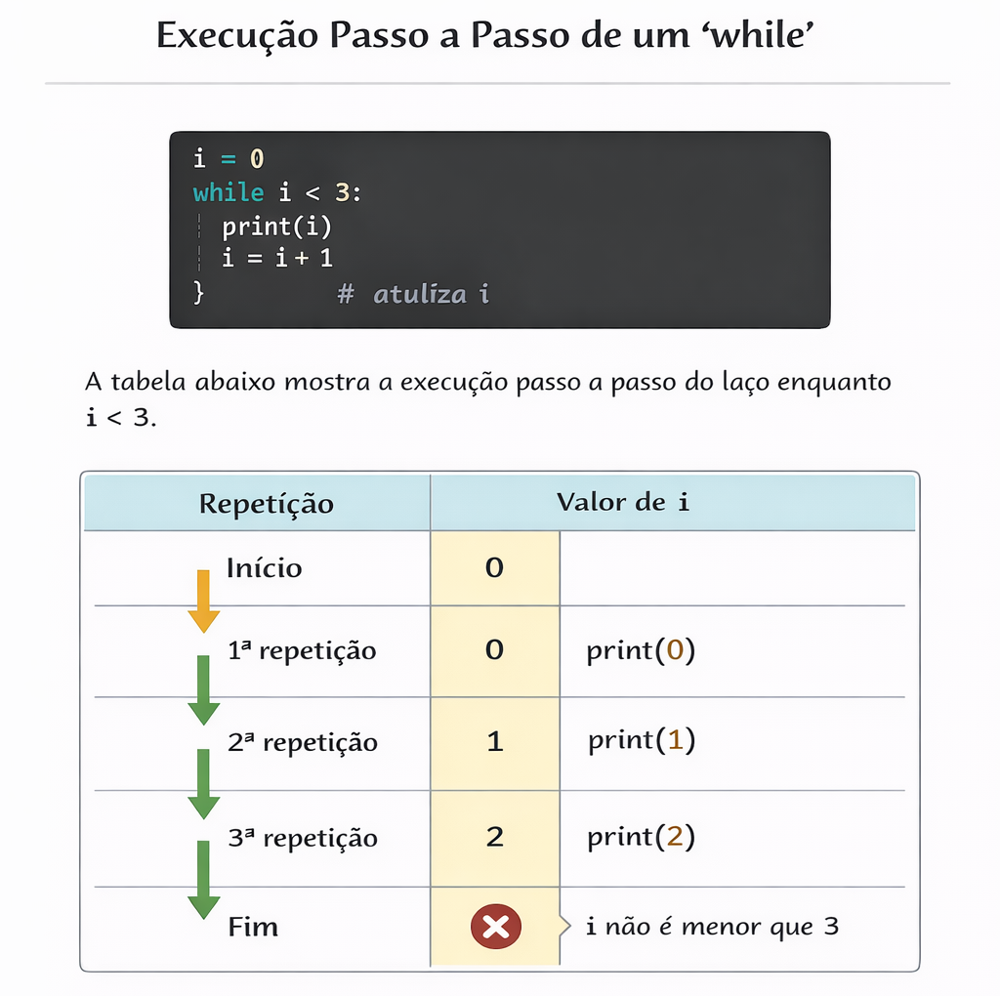
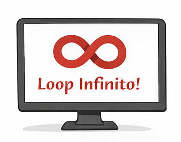

### Outro tipo de repetição: o laço `while`

Enquanto o laço **`for`** é utilizado quando queremos **percorrer uma sequência de valores**, o laço **`while`** é utilizado quando a repetição depende de **uma condição lógica**.

Podemos resumir essa diferença da seguinte forma:

* **`for` → repetição por sequência**
* **`while` → repetição por condição**

No `for`, a repetição acontece porque existe uma **sequência de valores a ser percorrida**. Já no `while`, a repetição acontece **enquanto uma determinada condição for verdadeira**.


### Estrutura básica do `while`

```python
while condição:
    instruções
```

Nesse tipo de laço, o Python **avalia primeiro a condição**.

* Se a condição for **verdadeira (`True`)**, o bloco de instruções é executado.
* Depois da execução do bloco de código, a condição é **avaliada novamente**.
* O processo continua **enquanto a condição permanecer verdadeira**.



Quando a condição se torna **falsa (`False`)**, o laço é encerrado e o programa continua executando as próximas instruções.


O exemplo abaixo imprime os números de **0 a 4** utilizando `while`.

```python
i = 0

while i < 5:
    print("Contando:", i)
    i = i + 1
```

Saída:

```
Contando: 0
Contando: 1
Contando: 2
Contando: 3
Contando: 4
```

Observe que nesse caso **não existe uma sequência gerada automaticamente**, como ocorre com `range()` no `for`.

Por isso, precisamos:

1. **Criar a variável de controle**
2. **Definir a condição do laço**
3. **Atualizar a variável dentro do laço**

No exemplo, a variável `i` começa com valor **0**, e a repetição ocorre enquanto **`i < 5`**.

A instrução:

```python
i = i + 1
```

é responsável por **atualizar o valor da variável**, permitindo que a condição eventualmente se torne falsa e o laço termine.

:::pitfall Cuidado com o Laço Infinito

```python
i = 0
while i < 5:
    print("valor!", i)
#ops este laço nunca termina, e o valor nunca muda
```
---


---
Sempre lembre de atualizar a variável dentro do `while`.
:::

Podemos resolver o mesmo problema usando os dois tipos de laço.

:::compare for vs while

```python
for i in range(5):
    print(i)
```

---

```python
i = 0
while i < 5:
    print(i)
    i = i + 1
```

---

Ambos produzem o mesmo resultado.
```
0
1
2
3
4
```

:::

A diferença está na **forma de controlar a repetição**.

* No **`for`**, a repetição ocorre porque existe uma **sequência de valores**.
* No **`while`**, a repetição ocorre porque uma **condição permanece verdadeira**.

> Assim como no laço `for`, o Python executa as instruções do `while` **de forma sequencial**, repetindo o bloco de código até que a condição deixe de ser verdadeira. O ponto fundamental desse tipo de estrutura é garantir que **a condição seja modificada dentro do laço**, caso contrário a repetição pode ocorrer indefinidamente.


