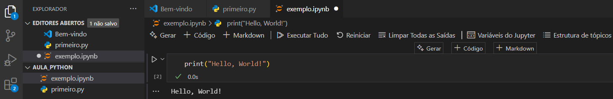

### Primeiro programa

Com o Visual Studio Code já instalado e configurado com a extensão Jupyter, podemos utilizar o próprio VS Code para executar blocos de código interativos, similares ao que encontraríamos em notebooks online como o Google Colab. Para isso, basta abrir um novo arquivo com a extensão .py ou um notebook .ipynb e começar a escrever o código.

O programa em si é extremamente simples. O código abaixo constitui um programa Python válido e completo:



Esse comando realiza uma única tarefa: ele instrui o interpretador Python a imprimir uma mensagem na tela. A função print() é uma das funções embutidas da linguagem, ou seja, ela já vem pronta para uso sem a necessidade de importar bibliotecas ou módulos externos. A palavra print vem do inglês e significa “imprimir”. Em programação, imprimir não significa usar uma impressora física, mas sim exibir um resultado na saída padrão — geralmente o terminal ou console.

Entre parênteses, passamos uma sequência de caracteres, conhecida como string, que é o conteúdo que desejamos imprimir. No exemplo, usamos "Hello, World!", que é um texto entre aspas duplas. Em Python, strings podem ser delimitadas tanto por aspas simples quanto por aspas duplas, mas é importante que estejam balanceadas. A presença das aspas indica ao interpretador que o conteúdo entre elas deve ser tratado como texto literal, e não como código.

Ao executar esse programa no VS Code, seja por meio do terminal integrado ou em uma célula do Jupyter, o resultado será a exibição da mensagem "Hello, World!" abaixo do código. Isso significa que o Python leu e interpretou corretamente o comando, e que o ambiente está funcionando conforme esperado.

Esse pequeno exemplo, embora extremamente simples, nos permite introduzir uma série de conceitos fundamentais da programação: funções, strings, sintaxe e ambiente de execução. A partir desse ponto, o estudante pode começar a experimentar modificações, como alterar a mensagem, usar diferentes tipos de dados ou incluir múltiplos comandos para começar a construir programas mais elaborados.

Outro exemplo simples que pede ao usuário seu nome e, em seguida, imprime uma saudação personalizada. O código fica assim:

```python 
nome = input("Qual é o seu nome? ")
print("Olá,", nome, "seja bem-vindo ao mundo do Python!")
```

Neste novo programa, a função input() é usada para capturar uma informação digitada pelo usuário no console. O texto dentro dos parênteses de input(), "Qual é o seu nome? ", é exibido como um prompt, ou seja, uma pergunta que orienta o usuário sobre o que deve ser digitado. Assim que o usuário digita algo e pressiona Enter, o valor inserido é armazenado em uma variável chamada nome

Variáveis são espaços nomeados na memória do computador onde podemos guardar valores temporários enquanto o programa está em execução. No exemplo acima, o valor digitado — digamos, "Maria" — é armazenado na variável nome, e pode ser reutilizado em outros pontos do código. O comando print() que vem em seguida utiliza esse valor armazenado para compor uma saudação dinâmica. Em vez de uma mensagem fixa como “Hello, World!”, o programa agora responde com uma saudação adaptada ao nome informado pelo usuário, como por exemplo: “Olá, Maria, seja bem-vinda ao mundo do Python!”.

Note que a função print() permite múltiplos argumentos separados por vírgulas, e o Python automaticamente insere espaços entre eles na exibição final. Isso facilita a construção de mensagens sem a necessidade de usar operações de concatenação explícita (como +), embora essas também sejam possíveis.

Esse pequeno ajuste na estrutura do programa já nos permite compreender melhor como interagir com o usuário e como manipular dados em tempo de execução. A partir desse ponto, o estudante pode ser incentivado a experimentar novas perguntas, armazenar respostas em diferentes variáveis, e usar essas informações para tomar decisões dentro do programa.