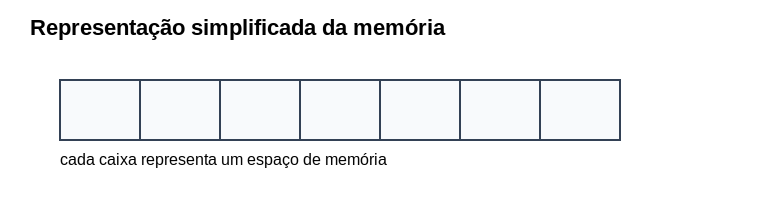

# Memória, variáveis e atribuição

Em programação, **variáveis** são utilizadas para armazenar valores que poderão ser utilizados durante a execução de um programa.

Antes de compreender o conceito de variável, é importante entender, ainda que de forma simplificada, **como a memória do computador pode ser imaginada**.

Um computador possui memória principal (RAM), que é utilizada para armazenar dados e instruções enquanto os programas estão sendo executados. Em computadores atuais, essa memória pode ter vários gigabytes — por exemplo, **8 GB ou 16 GB de memória RAM**. Vamos então, imaginar essa memória como **um grande conjunto de compartimentos onde informações podem ser guardadas**.

Esses compartimentos funcionam como **caixas**, nas quais os dados são armazenados temporariamente enquanto o programa está em execução, desta forma cada caixa representa um pequeno espaço onde um valor pode ser armazenado.



:::tip
Fisicamente, a memória do computador é composta por milhões de pequenas células eletrônicas capazes de armazenar bits (0 ou 1). Para o processador, essas células são organizadas em unidades chamadas bytes, que possuem endereços que permitem localizar cada posição da memória.

Com o objetivo de facilitar o entendimento inicial, fo adotado a representação da memória como um conjunto de caixas, nas quais valores podem ser armazenados. Embora essa representação seja simplificada, ela pretende ajudar a compreender como variáveis armazenam informações durante a execução de um programa.
:::

### Endereços de memória

Cada posição da memória possui um **endereço**, que indica onde o dado está localizado. Podemos imaginar esses endereços como números que identificam cada caixa.

Na prática, programas não manipulam diretamente esses endereços em linguagens de alto nível como Python. Em vez disso, utilizamos **variáveis**, que funcionam como nomes associados a esses espaços de memória.


O que leva a pensar que uma **variável** pode ser entendida como um **nome associado a um espaço da memória**. Em vez de trabalhar diretamente com endereços numéricos, o programador utiliza nomes mais significativos.

Por exemplo:

```python
idade = 20
```

Nesse caso:

* `idade` é o **nome da variável**
* `20` é o **valor armazenado**

Podemos representar isso visualmente da seguinte forma:


Assim, a variável funciona como um **rótulo que identifica onde um determinado valor está armazenado na memória**.

### Atribuição de valores

Quando escrevemos uma instrução como:

```python
salario = 1500
```

estamos realizando uma **atribuição**.

Isso significa que o valor **1500** passa a ser armazenado na variável `salario`, para fixar podemos ler como salario recebe 1500. Esta forma de ler irá de ajudar a compreender que o operador `=` não representa igualdade matemática, mas sim **armazenamento de valores**.

### Tipos de dados e tamanho da memória

Os valores armazenados em variáveis possuem **tipos de dados**, que indicam a natureza da informação. Alguns exemplos comuns são:

| Tipo           | Exemplo |
| -------------- | ------- |
| inteiro        | 10      |
| número real    | 3.14    |
| texto (string) | "Ana"   |
| lógico         | True    |

Cada tipo de dado pode ocupar **quantidades diferentes de memória**, dependendo da linguagem e da implementação. Em linguagens de alto nível como Python, esse gerenciamento é feito automaticamente pelo ambiente de execução, permitindo que o programador concentre sua atenção na lógica do algoritmo.

:::tip
Em programação, o símbolo `=` não representa igualdade matemática.
Ele representa **atribuição**, isto é, uma instrução que coloca um valor dentro de uma variável.
:::

### Constantes

Uma **constante** representa um valor fixo no problema.

Por exemplo:

```python
PI = 3.14159
DIAS_ANO = 365
```

Esses valores representam **informações permanentes**, que não devem ser alteradas durante a execução do programa. Em Python, por convenção, constantes são escritas em **letras maiúsculas**.

### Exemplo comentado

Considere o seguinte programa:

```python
a = 2
b = 3

soma = a + b

print(soma)
```

Explicação passo a passo:

1. a variável `a` recebe o valor **2**
2. a variável `b` recebe o valor **3**
3. a variável `soma` recebe o resultado da expressão `a + b`
4. o programa exibe o resultado **5**

---

:::exercise
Indique quais elementos são **variáveis** e quais são **constantes** no algoritmo abaixo.

```text
idade = 21
PI = 3.14
nome = "Carlos"
DIAS_SEMANA = 7
```
:::

:::exercise
Explique em palavras o que acontece neste algoritmo

```
preco = 10
quantidade = 5
total = preco * quantidade
```
:::


:::exercise
Escreva um algoritmo que:

1. armazene o valor do raio de um círculo
2. utilize a constante `PI`
3. calcule a área do círculo

> **Fórmula:** A área de um círculo é dada por $A = \pi r^2$, onde:
> - $A$ é a área do círculo  
> - $r$ é o raio  
> - $\pi \approx 3.14159$

:::


:::exercise
Observe o algoritm, e responda quais são os valores finais de `a` e `b`?

```
a = 5
b = 10
c = a
a = b
b = c
```

:::


## Exercícios ddd

:::question
Explique o algoritmo abaixo.

```text
preco = 10
quantidade = 5
total = preco * quantidade
```
:::

:::question
Explique o algoritmo abaixo.

```text
preco = 10
quantidade = 5
total = preco * quantidade
```
:::
